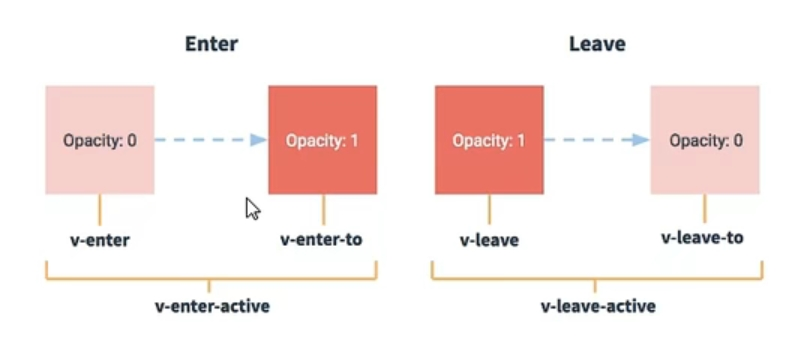

# 笔记

## 脚手架文件结构
|—— node_modules
|—— public
|   |——favicon.ico:页签图标
|   |——index.html: 主页面
|——src
|   |——assets:存放静态资源
|   |   |——1ogo.png
|   |——component: 存放组件
|   |   |——HelloWorld.vue
|   |——App.vue: 汇总所有组件
|   |——main.js: 入口文件
|——.gitignore: git版本管制忽略的配置

|——babel.config.js: babel的配置文件
|——package.json: 应用包配置文件
|——README.md:应用描述文件
|——package-lock.json: 包版本控制文件

## 关于不同版本的Vue：
-vue.js亏vue.runtime.xxx.js的区别:
    (1).vue.js是完整版的vue，包含:核心功能+模板解析器
    (2).vue.runtime.xxx.js是运行版的Vue，只包含: 核心功能:没有模板解析器
-因为vue.runtime.xxx.js没有模板解析器，所以不能使用template配置项，需要使用
    render函数接收到的createElement函数大指定具体内容。

## vue.config.js配置文件
>使用vue inspect > output.js可以查看到Vue脚手架的默认配置。
>使用vue.config.js可以对脚手架进行个性化定制，详情见: https://cli.vuejs.org/zh

## ref属性
1.被用来给元素或子组件注册引用信息(id的替代者)
2.应用在htm1标签上获取的是真实DOM元素，应用在组件标签上是组件实例对象(vc)
3.使用方式:
    打标识: <h1 ref="xxx">.....</h1> 或 <School ref="xxx"></School>
    获取: this.$refs.xxx

## 配置项props
    功能：让组件接收外部传过来的数据
    （1）传递数据：
        <Demo name="xxx"/>
    （2）接收数据:
        第一种方式（只接收）：
        props:['name']

        第二种方式（限制类型）：
        props：{
            name:Number
        }

        第三种方式（限制类型、限制必要性、指定默认值）：
        props:{
            name:{
                type:String, //类型
                required:true, //必要性
                default:'老王' //默认值
            }
        }
    ps：props是只读的，vue底层会监视你对props的修改，如果进行了修改，就会发出警告，若业务需求确实需要修改，那么复制props的内容到data中一份，然后去修改data中的数据

## mixin(混入)
    功能：可以把多个组件共用的配置提取成一个混入对象
    使用方式：
        第一步定义混合，例如：
            {
                data(){....},
                methods:{....}
                ....
            }
        第二步使用混入，例如：
            （1）全局混入：Vue.mixin(xxx)
            （2）局部混入：mixins:['xxx']

## 插件
    功能：用于增强Vue
    本质：包含install方法的一个对象，install的第一个参数是Vue，第二个以后的参数是插件使用者传递的数据。
    定义插件：
        对象.install = function（Vue，options）{
            1.// 添加全局过滤器
            Vue.filter(....)

            2.// 添加全局指令
            Vue.directive(....)

            3.// 配置全局混入
            Vue.mixin(....)

            4.//添加实例方法
            Vue.prototype.$myMethods = function(){...}
            Vue.prototype.$myProperty = xxx
        }
    使用插件：Vue.use()

## scoped样式
    作用：让样式在局部生效，防止冲突
    写法：<style scoped>

## 总结TodoList案例
1.组件化编辑流程：
    1）拆分静态组件：组件要按照功能点拆分，命名不要与html元素冲突
    2）实现动态组件：考虑好数据的存放位置，数据是一个组件在用，还是一些组件在用：
        Ⅰ一个组件在用：放在组件自身即可
        Ⅱ一些组件在用：放在他们共同的父组件上状态提升
    3）实现交互：从绑定事件开始
2.props适用于：
    1）父组件 ==> 子组件 通信
    2）子组件 ==> 父组件 通信（要求父先给子一个函数
3.使用v-model时要记住：v-model绑定的值不能是props传过来的值，因为props是不可以修改的
4.props传过来的若是对象类型的值，修改对象中的属性时Vue不会报错，但不推荐

## 组件的自定义事件
1.一种组件间通信的方式，适用于：子组件 ==> 父组件
2.使用场景：A是父组件，B是子组件，B想给A传数据，那么就要在A中给B绑定自定义事件（事件的回调在A中）
3.绑定自定义事件：
    1）第一种方式：在父组件中 <Demo @test="test"/> 或 <Demo v-on:test="test"/>
    2）第二种方式：在父组件中：
        <Demo ref="demo"/>
        ....
        mounted(){
            this.$ref.xxx.$on('test'.test)
        }
    3）若想让自定义事件只能触发一次，可以使用once修饰符，或$once方法
4.触发自定义事件：this.$emit('test',数据)
5.解绑自定义事件：this.$off('test')
6.组件上也可以绑定原生DOM事件，需要使用native修饰符
7.ps：通过this.$ref.xxx.$on('test'.回调)绑定自定义事件时，回调要么配置在methods中，要么用箭头函数，否则this指向会出问题

## 全局事件总线
1.一种组件间通信的方式，适用于任意组件间通信
2.安装全局事件总线：
    new Vue({
        ...
        beforeCreate(){
            Vue.prototype.$bus = this //安装全局事件总线，$bus就是当前应用的
        }
    })
3.使用事件总线：
    1）接收数据：A组件想接收数据，则在A组件中给$bus绑定自定义事件，事件的回调留在A组件自身
    methods(){
        demo(data){...}
    }
    ...
    mounted(){
        this.$bus.$on('xxx',this.demo)
    }
    2）提供数据：this.$bus.$emit('xxx',数据)
4.最好在beforeDestroy钩子中，用$off去解绑当前组件所用到的事件

## 消息订阅与发布
1.一种组件间通信的方式，适用于任意组件间通信
2.使用步骤：
    1）安装pubsub：npm i pubsub-js
    2）引入：import pubsub from 'pubsub-js'
    3）接收数据：A组件想接收数据，则在A组件中订阅消息，订阅的回调留在A组件自身
    methods(){
        demo(data){...}
    }
    ...
    mounted(){
        this.pid = pubsub.subscribe('xxx',this.demo) //订阅消息
    }
    4）提供数据：pubsub.publish('xxx',数据)
    5）最好在beforeDestroy钩子中，用PubSub.unsubscribe(pid)去取消订阅

## Vue封装的过渡与动画
1.作用：在插入、更新或移除DOM元素时，在合适的时候给元素添加样式类名
2.图示：
3.写法：
    1.准备好样式：
        元素进入的样式：
            1.v-enter：进入的起点
            2.v-enter-active：进入进程中
            3.v-enter-to：进入的终点
        元素离开的样式：
            1.v-leave：离开的起点
            2.v-leave-active：离开进程中
            3.v-leave-to：离开的终点
    2.使用<transition>包裹要过度的元素，并配置name属性
    <transition name="hello">
        <h1 v-show="isShow">你好</h1>
    </transition>
    3.ps:若有多个元素需要过度，则需要使用：<transition-group>，且每个元素都要都指定key值

## vue脚手架配置代理
### 方法一
    在vue.config.js中添加如下配置：
    devServer：{
        proxy:'http://localhost:5000'
    }
    说明：
        1.优点：配置简单，请求资源时直接发给前端（8080）即可
        2.缺点：不能配置多个代理，不能灵活的控制请求是否走代理
        3.工作方式：若按照上述配置代理，当请求了前端不存在的资源时，那么该请求会转发给服务器（优先匹配前端资源）
### 方法二
    编写vue.config.js配置具体代理规则：
    module.exports = defineConfig({
        // 方式二：开启代理服务器
        devServer:{
            proxy:{
            '/api':{
                target:'<http://localhost:5000>',
                pathRewrite:{'^/api':''}
                // ws:true,//   用于支持websocket
                // changeOrigin:true, //用于请求头中的host值
            },
            // '/foo':{
            //   target:'<other_url>'
            // }
            }
        }
    })
    changeOrigin为true时，服务器收到的请求头中的host为：localhost：5000
    changeOrigin为false时，服务器收到的请求头中的host为：localhost：8080

    说明：
        1.优点；可以配置多个代理，且可以灵活的控制请求是否走代理
        2.缺点；配置略显繁琐，请求资源时必须加前缀

## 插槽
1.作用：让父组件可以向子组件指定位置插入html结构，也是一种组件间通信的方式，适用于父组件 ==> 子组件
2.分类：默认插槽，具名插槽，作用域插槽
3.使用方式：
    1）默认插槽：
    父组件中：
    <cateGory>
        
html结构

    </cateGory>
    子组件中：
    <template>
        

            //定义插槽
            <slot>插槽默认内容</slot>
        

    </template>
    2）具名插槽
    父组件中：
    <cateGory>
        <template slot="center">
            
html结构

        </template>        
        <template v-slot:footer>
            
html结构

        </template>
    </cateGory>
    子组件中：
    <template>
        

            //定义插槽
            <slot name="center">插槽默认内容</slot>
            <slot name="footer">插槽默认内容</slot>
        

    </template>   
    3）作用于插槽
        1.理解：数据在组件的自身，但根据数据生成的结构需要组件的使用者决定。（games数据在Category组件中，但使用数据所遍历出来的结构由App组件决定）
        2.具体编码：
        父组件中：
        <cateGory>
            <template scope="scopeData">
            <!-- 生成的是ul -->
                <ul>
                    <li v-for="g in scopeData.games" :key="g">{{g}}</li>
                </ul>
            </template>
        </cateGory>            
        <cateGory>
            <template slot-scope="scopeData">
            <!-- 生成的是h4标题 -->
                <h4 v-for="g in scopeData" :key="g">{{g}}</h4>
            </template>
        </cateGory>
        子组件中：
        <template>
            

                <slot :games="games"></slot>
            

        </template>
            

## Vuex
### 1.概念：
    在Vue中实现集中式状态（数据）管理的一个Vue插件，对Vue应用中多个组件的共享状态进行集中的管理（读/写），也是一种组件间通信的方式，且使用于任意组件间通信
### 2.何时使用
    多个组件需要共享数据时
### 3.搭建vuex环境
    1.创建文件：src/store/index.js
        //引入Vue核心库
        import Vue from 'vue'
        //引入vuex
        import Vuex from 'vuex'

        Vue.use(Vuex)
        //准备actions 用于响应组件中的动作
        const actions = {}

        //准备mutations 用于操作数据（state）
        const mutations = {}

        //准备state 用于存储数据（state）
        const state = {}

        //创建并导出store
        export default new Vuex.Store({
            actions,
            mutations,
            state,
        })
    2.在main.js中创建vm时传入store配置项
        //引入store
        import store from './store'
        new Vue({
            el:'#app',
            render: h => h(App),
            store,
        })
### 4.基本使用
    1.初始化数据，配置actions，配置mutations，操作文件store.js
        //引入Vue核心库
        import Vue from 'vue'
        //引入vuex
        import Vuex from 'vuex'
        Vue.use(Vuex)
        //准备actions 用于响应组件中的动作
        const actions = {
            add(context,value){
                context.commit('Add',value)
            }, 
        }   
        //准备mutations 用于操作数据（state）
        const mutations = {
            Add(state,value){
                state.sum += value
            },    
        }

        //准备state 用于存储数据（state）
        const state = {
            sum:0, //当前和
        }

        //创建并导出store
        export default new Vuex.Store({
            actions,
            mutations,
            state,
        })
    2.组件中读取vuex中的数据：$store.state.sum
    3.组件中修改vuex中的数据：$store.dispatch('action中的方法名',数据) 或 $store.commit('mutations中的方法名',数据)
    ps:如果没有网络请求或其他业务逻辑，组件中也可以越过actions，即不写dispatch，直接编写commit
### 5.getters
    1.概念：当state中的数据需要经过加工后再使用时，可以使用getters加工
    2.在store.js中追加getters配置
        //准备state 用于将state中的数据进行加工
        const getters = {
            bigSum(state){
                return state.sum*10
            }
        }

        //创建并导出store
        export default new Vuex.Store({
            ....
            getters,
        })
    3.组件中读取数据$store.getter.bigSum
### 6.四个map方法使用
    1.mapState方法：用于帮助我们映射state中的数据为计算属性
        computed：{
            //借助mapState生成计算属性，从state中读取数据（对象写法）
            ...mapState({
                sum:'sum',
                school:'school',
                subject:'subject',
            }),
            //借助mapState生成计算属性，从state中读取数据（数组写法）
            ...mapState(['sum','school','subject']),
        }
    2.mapGetters方法：用于帮助我们映射getters中的数据为计算属性
        computed:{
            //借助mapGetters生成计算属性，从state中读取数据（对象写法）
            ...mapGetters({bigSum:'bigSum'})
            //借助mapGetters生成计算属性，从state中读取数据（数组写法）
            ...mapGetters(['bigSum']) 
        }   
    3.mapActions方法：用于帮助我们生成actions对话的方法，即：包含$store.dispatch(xxx)的函数
        methods:{
            //借助mapActions生成对应的方法，方法中会调用dispatch去联系actions（对象写法）
             ...mapActions({
                 incrementOdd:'addOdd',
                 incrementWait:'addWait'
             })  

            //借助mapActions生成对应的方法，方法中会调用dispatch去联系actions（数组写法）
            ...mapActions([
                'addOdd',
                'addWait'
            ])
        }
    4.mapMutations方法：用于帮助我们生成mutations对话的方法，即：包含$store.commit(xxx)的函数
        methods:{
            //借助mapMutations生成对应的方法，方法中会调用commit去联系mutations（对象写法）
            ...mapMutations({
                increment:'Add',
                decrement:'Reduce'
            }),
            //借助mapMutations生成对应的方法，方法中会调用commit去联系mutations（数组写法）
            // ...mapMutations(['Add','Reduce']),
        }
### 7.modules+namespaced
    1.目的：让代码更好维护，让多种数据分类更加明确
    2.修改store.js
        const countAbout={
            namespaced:true, //开启命名空间
            state:{x:1},
            mutation:{},
            actions:{},
            getters:{
                bigSum(state){
                    return state.sum*10
                }
            }
        }        
        const personAbout={
            namespaced:true, //开启命名空间
            state:{x:1},
            mutation:{},
            actions:{},
            getters:{}
        }
        const store = new Vuex.Store({
            modules:{
                countAbout,
                personAbout
            }
        })
    3.开启命名空间后
            // ...mapState('countAbout',['sum']),
            // ...mapState('personAbout',['personList']),
            // ...mapGetters('personAbout',['firstPersonName']),
            
            personList(){
                return this.$store.state.personAbout.personList
            },
            sum(){
                return this.$store.state.countAbout.sum
            },
            firstPersonName(){
                return this.$store.getters['personAbout/firstPersonName']
            },

## 路由
    1.理解：一个路由（route）就是一组映射关系（key-value），多个路由需要路由器（router）进行管理
    2.前端路由：key是路径，value是组件
### 1.基本使用
    1.安装vue-router，命令 npm i vue-router
    2.应用插件：Vue.use(VueRouter)
    3.编写router配置项
        //该文件用于创建整个应用的路由器
        import VueRouter from 'vue-router'
        //引入组件
        import About from '../components/About'
        import Home from '../components/Home'

        export default new VueRouter({
            routes:[
                {
                    path:'/about',
                    component:About,
                },        
                {
                    path:'/home',
                    component:Home,
                },
            ]
        })
    4.实现切换（active-class可配置高亮样式）
        <router-link class="list-group-item" active-class="active" to="/about">About</router-link>
    5.指定展示位置
        <router-view></router-view>

### 2.注意点
    1.路由组件通常存放在 pages 文件夹，一般组件通常存放在 components 文件夹
    2.通过切换，'隐藏'了的路由组件，默认是被销毁掉的，需要的时候再去挂载
    3.每个组件都有自己的$route属性，里面存储着自己的路由信息
    4.整个应用只有一个router，可以通过组件的$router属性获取到

### 3.多级路由
    1.配置路由规则，使用children配置项：
        routes:[
            {
                path:'/about',
                component:About,
            },        
            {
                path:'/home',
                component:Home,
                children:[
                    {
                        path:'news',
                        component:News,
                    },                
                    {
                        path:'message',
                        component:Message,
                    },
                ]
            },
        ],
    2.跳转（要写完整路径
        <router-link class="list-group-item" active-class="active" to="/home/news">News</router-link>

### 4.路由的query参数
    1.传递参数
        <!-- 跳转路由并携带query参数 to的字符串写法 -->
        <router-link :to="`/home/message/detail?id=${msg.id}&title=${msg.title}`">{{msg.title}}</router-link>&nbsp;&nbsp;
        
        <!-- 跳转路由并携带query参数 to的对象写法 -->
        <router-link :to="{
            path:'/home/message/detail',
            query:{
                id:msg.id,
                title:msg.title
            }
        }">
            {{msg.title}}
        </router-link>
    2.接收参数
        $route.query.id
        $route.query.title

### 5.命名路由
    1.作用：可以简化路由的跳转
    2.使用：
        1）给路由命名：
            {
                path:'message',
                component:Message,
                children:[
                    {
                        name:'xiangqing',
                        path:'detail',
                        component:Detail,
                    },           
                ]
            },
        2）简化跳转
            <router-link class="list-group-item" active-class="active" to="{name:about}">About</router-link>

### 6.路由的params参数
    1.配置路由，声明接受params参数
        {
            path:'message',
            component:Message,
            children:[
                {
                    name:'xiangqing',
                    path:'detail/:id/:title',
                    component:Detail,
                },           
            ]
        },
    2.传递参数
        <!-- 跳转路由并携带params参数 to的字符串写法 -->
        <router-link :to="`/home/message/detail/${msg.id}/${msg.title}`">{{msg.title}}</router-link>&nbsp;&nbsp;
        
        <!-- 跳转路由并携带params参数 to的对象写法 -->
        <router-link :to="{
            name:'xiangqing',
            params:{
                id:msg.id,
                title:msg.title
            }
        }">
            {{msg.title}}
        </router-link>
    ps:路由携带params参数时，若使用to的对象写法，则不能使用path配置项，必须使用name配置
    3.接收参数
        $route.params.id
        $route.params.title

### 7.路由的props配置
    作用：让路由组件更方便的收到参数
        {
        name:'xiangqing',
        path:'detail/:id/:title',
        component:Detail,

        // props第一种写法，值为对象,该对象中的所有key-value都会以props形式传给Detail组件
        // props:{a:1,b:'hello'}

        // props第二种写法，值为布尔值，若布尔值为真，就会把该路由组件收到的所有params参数，以props的形式传给Detail组件
        // props:true

        //props第三种写法，值为函数，该函数返回的对象中每一组key-value都会以props形式传给Detail组件
        props($route){
            return{id:$route.query.id,title:$route.query.title}
        }                            
        // props({query}){
        //     return{id:query.id,title:query.title}
        // }
    },  

### 8.<router-link>的replace属性
    1.作用：控制路由跳转时操作浏览器历史记录的模式
    2.浏览器的历史记录有两种写入方式：分别为push和replace，push是追加历史记录，replace是替换当前记录，路由跳转时默认为push
    3.如何开启replace模式：
        <router-link replace ...>About</router-link>

### 9.编程式路由导航
    1.作用：不借助 <router-link> 实现路由跳转，让路由跳转更加灵活
    2.具体编码：
        //$router中的两个API
        pushShow(msg){
            this.$router.push({
                name:'xiangqing',
                params:{
                    id:msg.id,
                    title:msg.title
                }
            })
        },
        replaceShow(msg){
            this.$router.replace({
                name:'xiangqing',
                params:{
                    id:msg.id,
                    title:msg.title
                }
            })
        }
        //前进
        back(){
            this.$router.back()
        },
        //后退
        forward(){
            this.$router.forward()
        },
        //可前进也可后退
        go(){
            this.$router.go(-2) //后退2步 如果是正数就是前进2步
        }

### 10.缓存路由组件
    1.作用：让不展示的路由组件保持挂载，不被销毁
    2.具体编码：
        <!-- 组件名为News缓存不销毁 -->
        <keep-alive include="News">
            <router-view></router-view>
        </keep-alive>

### 11.生命周期钩子
    1.作用：路由组件所独有的两个钩子，用于捕获路由组件的激活状态
    2.具体名字：
        1）activated路由组件被激活时触发
        2）deactivated路由组件失活时触发

### 12.路由守卫
    1.作用：对路由进行权限控制
    2.分类：全局守卫、独享守卫、组件内守卫
    3.全局首位：
        //全局前置路由守卫----初始化时被调用，每次路由切换之前被调用
        router.beforeEach((to,from,next)=>{
        // if(to.path === '/home/news' || to.path === '/home/message'){
            if(to.meta.isAuth){  //判断是否需要鉴权
            if(localStorage.getItem('school') === '黑科技'){
                next()
            }else{
                alert('学校名不对，无权查看')
            }
                }else{
                    next()
                }
            })

        //全局后置路由守卫----初始化时被调用，每次路由切换之后被调用
        router.afterEach((to,from)=>{
            document.title = to.meta.title || '系统'    
        })
    4.独享守卫
        beforeEnter:(to, from, next) => {
            //独享路由守卫
            router.beforeEach((to,from,next)=>{

                // if(to.path === '/home/news' || to.path === '/home/message'){
                if(to.meta.isAuth){  //判断是否需要鉴权
                    if(localStorage.getItem('school') === '黑科技'){
                        next()
                    }else{
                        alert('学校名不对，无权查看')
                    }
                }else{
                    next()
                }
            })
            
        }
    5.组件内守卫：
        //进入守卫：通过路由规则，进入该组件时被调用
        beforeRouteEnter (to, from, next) {},
        //离开守卫：通过路由规则，离开该组件时被调用
        beforeRouteLeave (to, from, next) {}

### 13.路由器的两种工作模式
    1.对于一个url来说，什么是hash值
        #及后面的内容就是hash值
    2.hash值不会包含在HTTP请求中，即：hash值不会带给服务器
    3.hash模式：
        1）地址中永远带着#号，不美观
        2）若以后将地址通过第三方手机app分享，若app校验严格，则地址会被标记为不合法
        3）兼容性较好
    4.history模式：
        1）地址干净，美观
        2）兼容性和hash模式相比略差
        3）应用部署上线时需要后端人员支持，解决刷新页面服务端404的问题